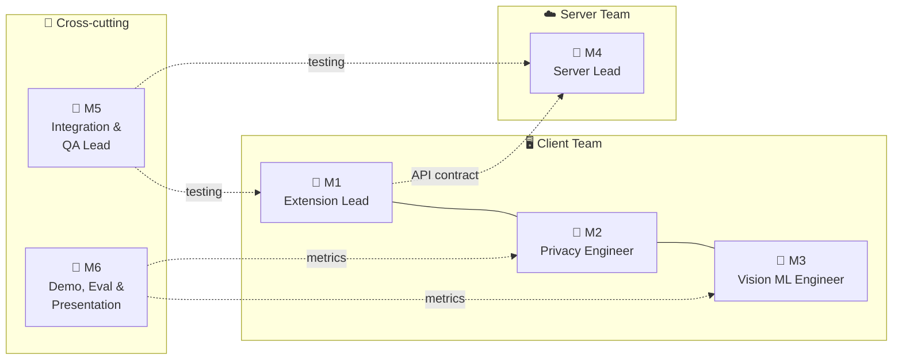
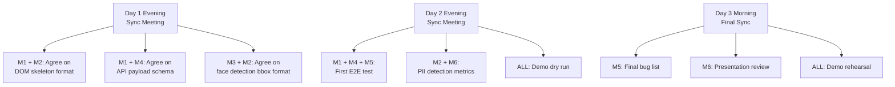

# 👥 Team Split — 6 Members × 3 Days

## Role Assignments

---

## 📌 File Ownership Map

### M1 — Extension Lead
> Owns the extension shell, UI, and orchestration layer

| File | Responsibility |
|------|---------------|
| [`manifest.json`](file:///Users/kratos_2004/Downloads/SIH26/extension/manifest.json) | Owner — permissions, CSP, content script registration |
| [`popup/popup.html`](file:///Users/kratos_2004/Downloads/SIH26/extension/popup/popup.html) | Owner — UI structure |
| [`popup/popup.css`](file:///Users/kratos_2004/Downloads/SIH26/extension/popup/popup.css) | Owner — styling |
| [`popup/popup.js`](file:///Users/kratos_2004/Downloads/SIH26/extension/popup/popup.js) | Owner — popup logic, message passing |
| [`background/service-worker.js`](file:///Users/kratos_2004/Downloads/SIH26/extension/background/service-worker.js) | Owner — pipeline orchestration, captureVisibleTab, server communication |
| [`content/overlay.js`](file:///Users/kratos_2004/Downloads/SIH26/extension/content/overlay.js) | Owner — visual feedback overlays |

**Day 1**: Get extension loading in Chrome, popup ↔ service worker ↔ content script message passing working, captureVisibleTab producing screenshots  
**Day 2**: Wire up end-to-end pipeline in service worker, polish popup UI with real status updates  
**Day 3**: Fix bugs, optimize, ensure smooth demo flow

---

### M2 — Privacy Engineer
> Owns the entire PII detection and redaction pipeline

| File | Responsibility |
|------|---------------|
| [`privacy/patterns.js`](file:///Users/kratos_2004/Downloads/SIH26/extension/privacy/patterns.js) | Owner — all regex patterns, field heuristics |
| [`privacy/pii-detector.js`](file:///Users/kratos_2004/Downloads/SIH26/extension/privacy/pii-detector.js) | Owner — multi-layer detection orchestration |
| [`privacy/redactor.js`](file:///Users/kratos_2004/Downloads/SIH26/extension/privacy/redactor.js) | Owner — screenshot redaction (blur, black-fill) |
| [`privacy/dom-sanitizer.js`](file:///Users/kratos_2004/Downloads/SIH26/extension/privacy/dom-sanitizer.js) | Owner — DOM value replacement with markers |
| [`content/dom-analyzer.js`](file:///Users/kratos_2004/Downloads/SIH26/extension/content/dom-analyzer.js) | Co-owner with M1 — sensitive field heuristics |

**Day 1**: Harden regex patterns, test against both demo pages, ensure Aadhaar/PAN/CC/phone/email all detected with zero false negatives  
**Day 2**: Implement and test redactor.js on real screenshots, integrate vision model results from M3, tune confidence thresholds  
**Day 3**: Precision tuning — reduce false positives while maintaining recall, collect detection metrics

---

### M3 — Vision ML Engineer
> Owns on-device model inference (ONNX Runtime Web)

| File | Responsibility |
|------|---------------|
| [`vision/pipeline.js`](file:///Users/kratos_2004/Downloads/SIH26/extension/vision/pipeline.js) | Owner — ONNX Runtime initialization, WebGPU/WASM backend |
| [`vision/face-detector.js`](file:///Users/kratos_2004/Downloads/SIH26/extension/vision/face-detector.js) | Owner — BlazeFace model loading, inference, post-processing |
| [`vision/text-detector.js`](file:///Users/kratos_2004/Downloads/SIH26/extension/vision/text-detector.js) | Owner — text region detection model |
| `extension/models/*.onnx` | Owner — model files, quantization, optimization |
| `extension/lib/ort.min.js` | Owner — ONNX Runtime Web bundling |

**Day 1**: Download BlazeFace ONNX model, get ONNX Runtime Web loading in extension context, run first face detection inference  
**Day 2**: Optimize model loading (lazy, cached), benchmark latency, integrate with M2's PII detector  
**Day 3**: Benchmark resource usage (RAM, GPU memory), ensure graceful fallback if WebGPU unavailable

> [!TIP]
> **Quick model sources:**
> - BlazeFace: [MediaPipe models](https://google.github.io/mediapipe/solutions/face_detection.html) → convert to ONNX
> - Or use `@mediapipe/face_detection` npm → WASM directly
> - ONNX Runtime Web: `npm install onnxruntime-web` or CDN `https://cdn.jsdelivr.net/npm/onnxruntime-web`

---

### M4 — Server Lead
> Owns the entire backend — FastAPI, VLM integration, prompt engineering

| File | Responsibility |
|------|---------------|
| [`server/main.py`](file:///Users/kratos_2004/Downloads/SIH26/server/main.py) | Owner — FastAPI app setup |
| [`server/config.py`](file:///Users/kratos_2004/Downloads/SIH26/server/config.py) | Owner — configuration management |
| [`server/models/schemas.py`](file:///Users/kratos_2004/Downloads/SIH26/server/models/schemas.py) | Owner — request/response schemas |
| [`server/routers/agent.py`](file:///Users/kratos_2004/Downloads/SIH26/server/routers/agent.py) | Owner — API endpoints |
| [`server/services/vlm_service.py`](file:///Users/kratos_2004/Downloads/SIH26/server/services/vlm_service.py) | Owner — Groq/Together AI integration |
| [`server/services/prompt_builder.py`](file:///Users/kratos_2004/Downloads/SIH26/server/services/prompt_builder.py) | Owner — prompt engineering |
| [`server/services/action_planner.py`](file:///Users/kratos_2004/Downloads/SIH26/server/services/action_planner.py) | Owner — VLM output parsing |
| [`server/services/conversation.py`](file:///Users/kratos_2004/Downloads/SIH26/server/services/conversation.py) | Owner — session management |

**Day 1**: Set up venv, get Groq API key, start server, verify VLM can analyze a screenshot and return JSON actions  
**Day 2**: Iterate on prompt engineering — test with redacted screenshots, improve action accuracy, add Together AI as backup  
**Day 3**: Stress test, handle edge cases, ensure reliable JSON parsing from VLM output

---

### M5 — Integration & QA Lead
> Owns end-to-end testing, bug tracking, cross-component integration

| Area | Responsibility |
|------|---------------|
| Git workflow | Set up repo, branching strategy, PR reviews |
| E2E testing | Extension → Server → Action execution flow |
| Bug tracking | Document issues, prioritize fixes |
| Cross-browser | Test on Chrome and Firefox |
| API contract | Ensure extension payload matches server schemas |
| [`content/action-executor.js`](file:///Users/kratos_2004/Downloads/SIH26/extension/content/action-executor.js) | Owner — executing server commands on pages |

**Day 1**: Set up git repo, test extension loads, test server starts, verify CORS works, first end-to-end message passing  
**Day 2**: Full integration testing — find and fix payload mismatches, test action execution, create bug list  
**Day 3**: Final regression testing, cross-browser check, ensure demo flow is bulletproof

---

### M6 — Demo, Evaluation & Presentation
> Owns demo pages, evaluation metrics, presentation, documentation

| Area | Responsibility |
|------|---------------|
| [`demo/test-pages/`](file:///Users/kratos_2004/Downloads/SIH26/demo/test-pages/) | Owner — test HTML pages |
| `demo/evaluation/` | Owner — evaluation scripts |
| [`README.md`](file:///Users/kratos_2004/Downloads/SIH26/README.md) | Owner — documentation |
| Presentation | Owner — slides, demo video |

**Day 1**: Create 1-2 more test pages (healthcare, social media), plan demo scenario, start presentation skeleton  
**Day 2**: Build evaluation scripts (PII detection precision/recall, latency measurement), record partial demo  
**Day 3**: Final presentation polish, record backup demo video, prepare Q&A answers

---

## RACI Matrix

| Component | M1 | M2 | M3 | M4 | M5 | M6 |
|-----------|:--:|:--:|:--:|:--:|:--:|:--:|
| Extension manifest & popup | **R** | I | I | I | C | I |
| Service worker orchestration | **R** | C | C | I | C | I |
| DOM analysis & extraction | C | **R** | I | I | C | I |
| PII regex patterns | I | **R** | I | I | C | C |
| PII detection pipeline | I | **R** | C | I | C | I |
| Screenshot redaction | I | **R** | C | I | C | I |
| DOM sanitization | I | **R** | I | I | C | I |
| Face detection (BlazeFace) | I | C | **R** | I | C | I |
| Text detection model | I | C | **R** | I | C | I |
| ONNX Runtime Web setup | C | I | **R** | I | C | I |
| FastAPI server | I | I | I | **R** | C | I |
| VLM integration (Groq) | I | I | I | **R** | C | I |
| Prompt engineering | I | C | I | **R** | I | C |
| Action planner | I | I | I | **R** | C | I |
| Action executor | C | I | I | I | **R** | I |
| Visual overlay | **R** | C | I | I | C | I |
| E2E integration testing | C | C | C | C | **R** | C |
| Demo test pages | I | C | I | I | C | **R** |
| Evaluation metrics | I | C | C | I | C | **R** |
| Presentation & docs | I | I | I | I | I | **R** |

> **R** = Responsible (does the work) · **C** = Consulted · **I** = Informed

---

## 🤝 Key Collaboration Points

## 💬 Communication

- **Chat group**: Create a team WhatsApp/Telegram group for async coordination
- **Daily sync**: 15-min standup each evening to share progress + blockers
- **Shared doc**: Google Doc for live bug tracking and notes
- **Git**: One `main` branch, feature branches per person, PR before merge
